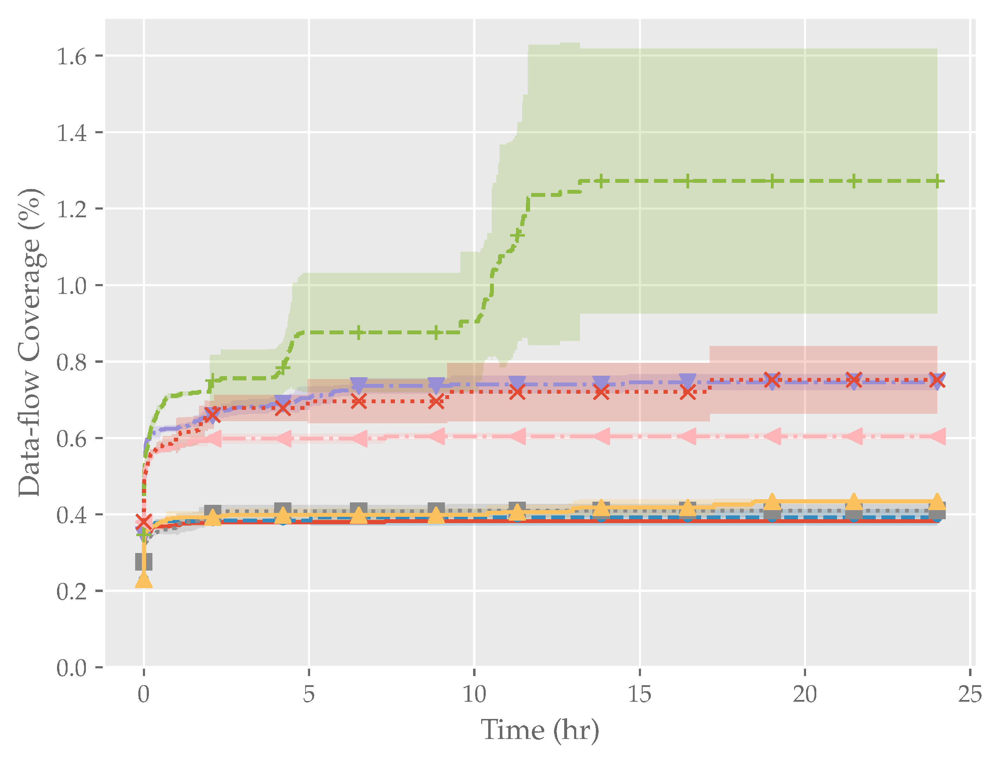
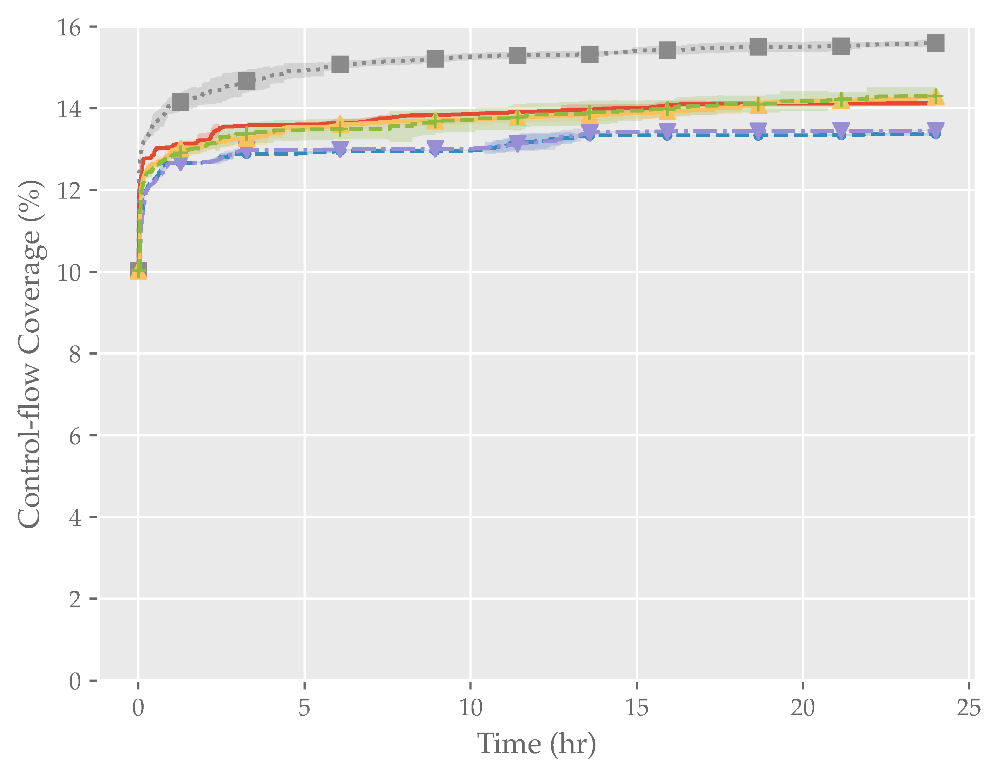

# Real-world Target Coverage Plots

## Legend

Control-flow coverage legend

Data-flow coverage legend

## Bison

# cxxfilt

## JSON-C

## LibTiff

## Lua

## mJS

## NASM

## PCRE2

## Poppler

## readelf

